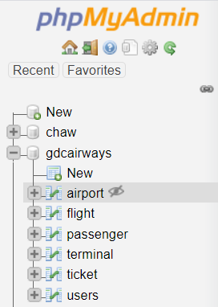
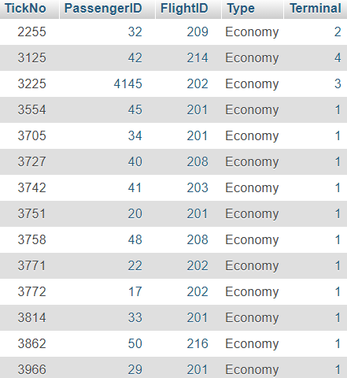

# Meta-Airways-Web-App
HTML, CSS, JavaScript, and PHP-based web application for Airline ticket management.

### Database Schema  

### Tables
* Airport  

* Flight  

* Passenger  

* Terminal  

* ticket  

* Users  

### Installation
* Install XAMPP
* Create all the database tables from phpMyAdmin
* Clone this repository
* Create a new Folder in xampp/htdocs/dashboard/
* Paste all the files in the new folder
* Run Xampp server
* Ping locahost/dashboard/new_folder_name
